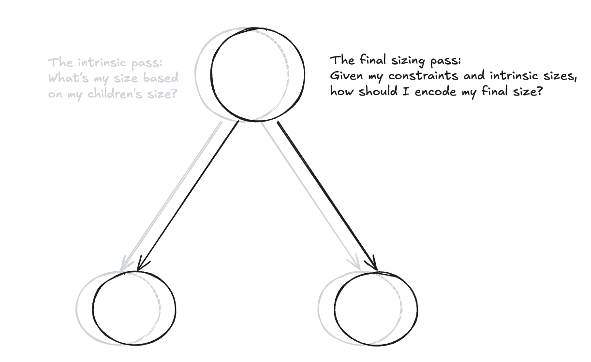

The HTML/CSS spec is extremely flexible in how it lets programmers size elements. The freedom granted by notions like intrinsic sizing - sizing an element based on its content - allows programmers to define responsive apps with ease. 

These compositional and styling choices get encoded in what we call the DOM tree. The DOM tree defines a tree with semantic elements as nodes. Children and styling attributes become a part of the parent's subtree.

Every decision then becomes recursion over this tree. But there's a clash between intrinsic sizing and this tree. Intrinsic sizing requires multiple passes: a pass that asks, *what size are my children?*, and a pass that actually sizes the element. One pass writes; one pass does not. One pass allows the parent to override the sizes that its children have (think about flex or grid); one pass recursively searches for each element's size based on its children's sizes. And what about text? Inline text doesn't include vertical padding, so our intrinsic sizing algorithm needs to address these small differences among layout modes.



Therefore, the multi-pass structure requires you to develop a recursive sizing contract that:
- Allows you to express different modes of sizing
- Distinguishes immutability from mutability over the tree
- Is consistent in *how* sizes are represented

In the rest of this post, I'll discuss how I develop a sizing contract that addresses these concerns for my browser renderer [Butterfly](https://github.com/taanishr/butterfly), with some inspiration from [Blink's LayoutNG](https://developer.chrome.com/docs/chromium/layoutng).

## The Broad Idea
Broadly speaking, a layout engine's sizing protocol involves sizing the current element via its styling attributes, and then using this size to construct a set of constraints for the node's children to size against. For example, the parent might have a width of `200px`, and its child may have a size of `50%`. The child's size would then become `100px`. More concretely, we will define different containing blocks which mostly correspond to what a parent's size is, but that's beyond this discussion.

Where this becomes complicated is if we let a parent node size itself based on its children's sizes. We would then need to measure the children's content sizes, find the containing box of the children, and then add padding and borders. We refer to this as determining the element's **intrinsic size**.

However, we only have one tree. To enable notions like intrinsic sizing, we need to separate intrinsic passes into those that are immutable and mutable. Immutable passes might recurse down subtrees asking children what their sizes are; mutable passes inject final sizes into nodes. 

This naturally leads to separating the *tree* from *effects*. When we want to size for real, we'll act on a mutable view of the tree; otherwise, we'll act on an immutable view.

Given this separation, as a content-sized node, we can then easily ask our children in a separate immutable view of the tree what their size would be, taking the max-extents for that final answer. Additionally, we can memoize these results in case someone else needs them for a question. This makes the actual algorithm *mostly* O(n), since for the exact same sizing and layout constraints, we will never run sizing twice. That being said, multi-pass algorithms like Grid/Flex, or content-based sizing, complicate this claim.

## Comparing models of immutability and mutability
LayoutNG, Blink's layout engine, also stresses the idea of mutability vs. immutability. However, they encode this more explicitly: the tree is always immutable, and recursion over the tree generates fragments that may be used for answering questions or setting a node's final size.

Their old solution was very similar to mine, with "mutable" and "immutable" passes over their layout tree. Where my solution differs from Blink's old solution is in how we encode mutability.

In my library, mutability vs. immutability is explicit; Blink's old layout engine generated mutable and immutable views implicitly based on complicated state management and flow control. Thus, the shape of my solution, while closer to Blink's old layout engine, lands nearer to the vision behind LayoutNG.

So why did they have to invoke complicated flow control checks where I didn't need to?

If you've ever read Chrome's codebase, you'll see that layout and sizing are *highly* intertwined. The HTML/CSS spec doesn't make separating these concerns very easy, and so you'll notice lots of one-off structs and special handlers in the sizing operations of each layout mode. I fixed this by reframing the spec; each layout mode asks these two questions:

1. What size should my container be?
2. How should I size my own children?

Most layout modes, including flex/grid, ultimately collapse to  sizing their container as either a block element or an inline element. And so we can structure each layout mode as first determining your container size via a request struct through a centralized resolver, then sizing your children. In block sizing, children size themselves; grid/flex require multiple passes as we resolve more and more constraints.

This eliminates essentially all these special sizing flags, and makes each layout mode quite clear. It also allows us to separate size resolution from finalization, which means sizes only really ever get set in one place. With this, we can cleanly guard mutability in one place.

Given my explanation, you might be wondering *why* Blink doesn't just use an explicit flag; this seems cheaper than immutable fragments. When you use flags, you also have to make sure you aren't accidentally leaking something inconsistent with your architectural contracts. For example, during intrinsic sizing, you want to forgo any previously set sizing overrides. Otherwise, you won't be collecting intrinsic sizes. At ~30,000 lines of code, this is relatively simple to manage. At ~3,000,000 lines of code, this is far harder to enforce. As the [Blink team wrote](https://developer.chrome.com/docs/chromium/layoutng), "If the code made the mistake of reading the size or position of an object at the incorrect time or stage (as we didn't "clear" the previous size or position for example), we would immediately add a subtle hysteresis bug."

## Going back to Intrinsic Sizing
With the immutability question solved, intrinsic sizing becomes very easy. From our mutable pass, we'll ask our children to size themselves in an immutable pass, then use that information for mutable sizing.

Let's say we have a parent that requests a content size width, with three children: one `200px` wide, one `300px` wide, and one `100px` wide. Let's say the second has a border of `2px`.

Firstly, whenever we ask intrinsic sizing questions, we always want the *border box* of each element. Why? Because that's the true content extent of the element; it's not just the explicitly stated size. Thus, we have a 200px wide element, 302px wide element, and 100px wide element.

Typically, we would just launch recursion as is; but when we're a node dependent on our content size, we will launch a request through the central evaluator that *we want* our intrinsic size.

This will launch another recursion over the tree starting at that node, except with some flags saying: hey, we're measuring intrinsic sizes.

In this mode, each child tells the parent its extent; we'll take the max of these extents. Once we return from that mode, we'll get an *intrinsic size*: in this case, a `302px` width. Our original sizing request, which kicked off the measurement, will use that result to determine its regular border box size. This will be returned in the mutating layout pass, which then finalizes the element's size.

Note, there's some complicated bookkeeping that comes out of this; we might have to deal with offsets, we have to adjust the cursor for siblings, etc..., and that's caused some painful bugs, but it's not anything major architecturally. But that's the gist of it.

## Generalizing this to deep subtrees
The idea of considering the border box is smart, but I faced some problems actually encoding this idea.

The centralized sizing evaluator in this library is `evaluateSize`, which dispatches certain jobs to other functions. If the node requires intrinsic sizing, either explicitly in the request or implicitly because of the node's constraints, we might make a call to `measureIntrinsicWidth` or `measureIntrinsicHeight`, which then makes a recursive layout call with two flags set: that we want to return intrinsic sizes, and that we do not want to mutate the tree.

<figure>

```c++
layout::LayoutResult layoutRecursive(
    TreeNode* node,
    const FrameInfo& frameInfo,
    Constraints constraints,
    bool mutate,
    std::optional<SizeRequest> sizeRequestOverride = std::nullopt,
    std::optional<IntrinsicRequest> intrinsicWidthRequestOverride = std::nullopt,
    std::optional<IntrinsicRequest> intrinsicHeightRequestOverride = std::nullopt
);
```

<figcaption>The recursive layout function.</figcaption>
</figure>

<figure>

```c++
struct LayoutResult {
    LayoutState layout;
    SizeResult sizeResult;
    std::optional<IntrinsicSizes> intrinsicSizes;
};
```

<figcaption>The <code>LayoutResult</code> type, which has an optional intrinsic size field; that intrinsic size is only resolved on request (<code>sizeRequestOverride</code>, <code>intrinsicWidthRequestOverride</code> or <code>intrinsicHeightRequestOverride</code> have it set). Intrinsic width and height resolution are mutually exclusive.</figcaption>
</figure>

This means recursive layout is the producer of intrinsic sizes, and `evaluateSize` uses that in its sizing algorithm. The problem is: who should figure out the intrinsically sized border box? `measureIntrinsicWidth/Height` or the recursive layout function? 

If you only do it at the `measureIntrinsicWidth/Height` call site, you'll run into this problem:

- Other layout modes, like inline text and block, will wrongly apply padding/borders.
- Intrinsic sizing is a *mode*. If a descendant of a node that requests intrinsic sizing also needs an intrinsic size, it will just measure its children's maximal extent. This will never touch `measureIntrinsicWidth/Height`, and thus padding/borders never get added.

This issue was hard to detect at first, since most intrinsic sizing examples only ever have a small depth, but this makes the solution clear. `measureIntrinsicWidth/Height` must *assume* `intrinsicSizes` is a border box. `layoutRecursive` already dispatches layout based on `display` type:

```c++
switch (display) {
    case style::Display::Flex: {
        intrinsicResult = layout::flexPass(*this, node, std::get<layout::BlockState>(layout), constraints, childConstraints, frameInfo, sizeResult, sizeRequest, mutate, sizeCache);
        break;
    }
    case style::Display::Grid: {
        intrinsicResult = layout::gridPass(*this, node, std::get<layout::BlockState>(layout), constraints, childConstraints, frameInfo, sizeResult, sizeRequest, mutate, sizeCache);
        break;
    }
    case style::Display::Block: {
        intrinsicResult = layout::blockPass(*this, node, frameInfo, std::get<layout::BlockState>(layout), childConstraints, sizeRequest, sizeResult, mutate, sizeCache);
        break;
    }
    case style::Display::Inline: {
        intrinsicResult = layout::inlinePass(std::get<layout::InlineState>(layout), sizeRequest);
        break;
    }
}
```

Instead of just being for sizing children, these modes could also become the resolvers for intrinsic sizing. And thus, we could encode each layout mode's border-box differences (e.g. text not including vertical padding) while ensuring we never double or under-count padding/borders.

## Conclusion
By centralizing sizing, my browser renderer shrinks the sizing decision space. Any flags we need to kick off intrinsic sizing touch one surface (like disabling the sizing overrides in `measureIntrinsicWidth/Height` and disabling mutability over the tree). This makes encoding immutability far easier; there's only ever one place sizes are set, so we can just guard it against our `mutate` flag. And by thinking about the producer-consumer relationship of intrinsic sizes, we can shore up the problem of consistently returning a border box across layout modes. 

By establishing mutability boundaries and clearly defining our contracts and expectations, designing recursive algorithms becomes *much* easier, which is especially important for my project given how much a browser renderer revolves around traversing trees.

## Notes
- My definition of intrinsic sizing is not an *exact* match of what the HTML/CSS spec says, but it is relatively close and generally asks what size an element is based on its children.
- I make several simplifications for the sake of the reader. The numeric border box examples aren't meant as a precise treatment of how border boxes work.
- For more concrete examples of what complex conditionals in Blink might look like, see the [LayoutNG blog](https://developer.chrome.com/docs/chromium/layoutng).