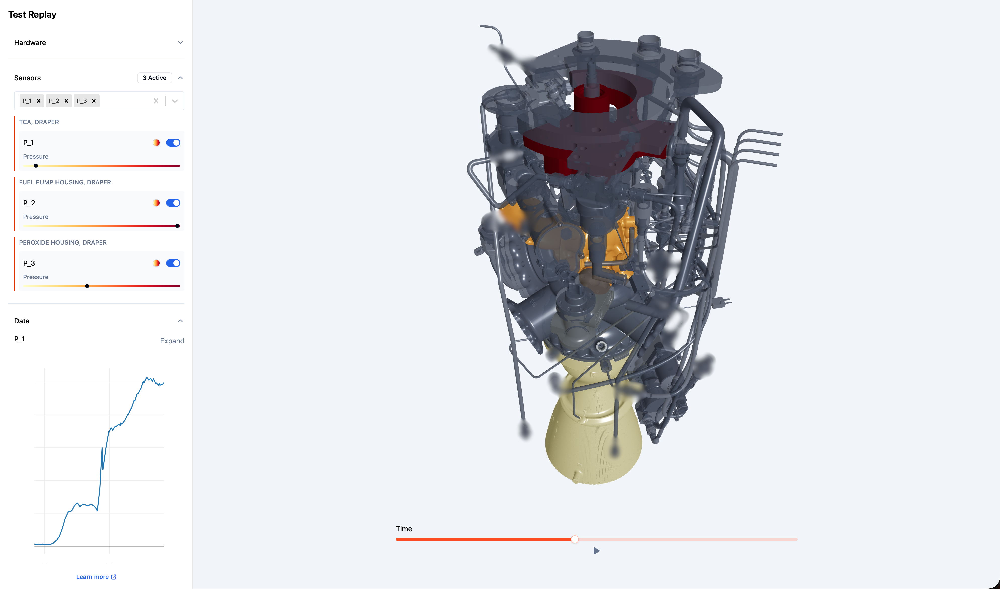
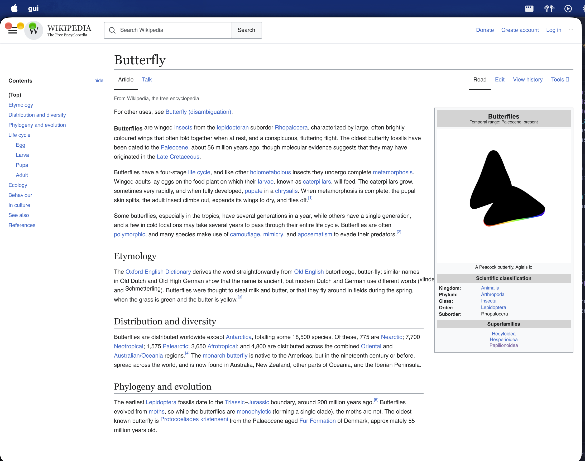
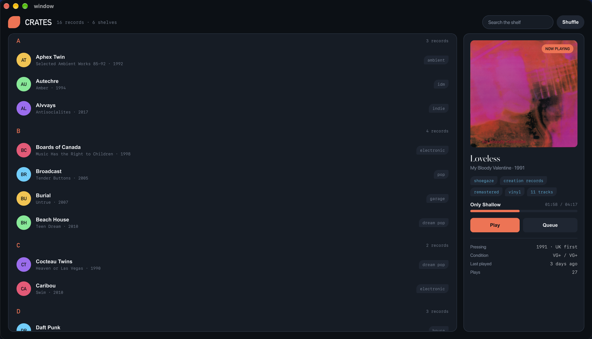
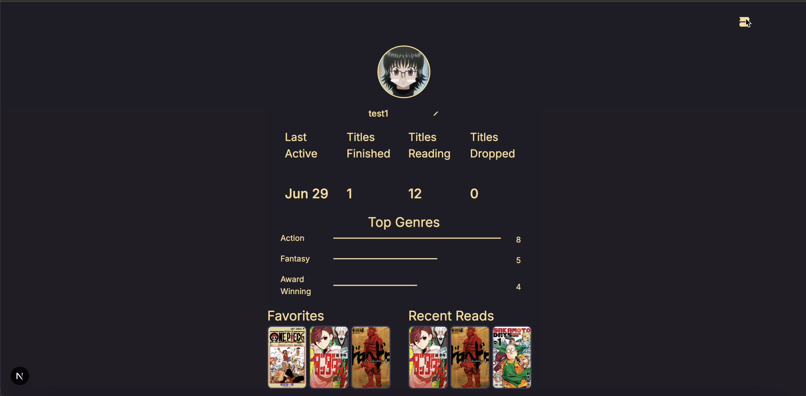
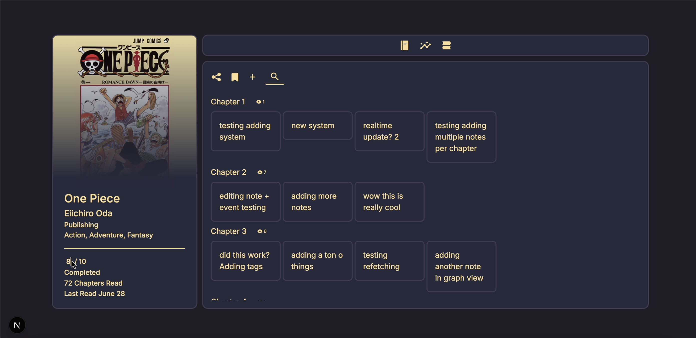
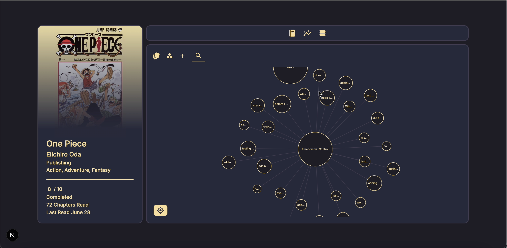
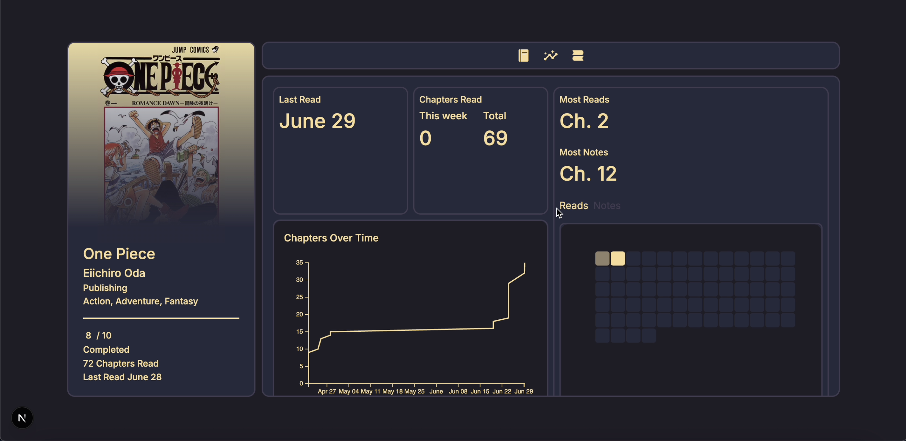

import Contributions from '../components/Contributions.astro';
import NowPlaying from '../components/NowPlaying.astro';

hi, \
I'm Taanish Reja, a 4th year CS student @ UCSD. I like working on compilers, PL and GPU programming problems.

you can find my github and linkedin here:
- <a href="https://github.com/taanishr">github</a>
- <a href="https://www.linkedin.com/in/taanish-reja">linkedin</a>
    
## coding activities
<Contributions />

## work experience
### Software Engineering Intern @ Ursa Major (Jun-Aug 2026)
Fixed a lot of React issues and worked on a cool interactive test replay viewer that colors different parts of a rocket engine CAD model over time based on the location of selected sensors and their readings.

<figure>

<figcaption>a screenshot of my intern project, built on top of React and Three.js</figcaption>
</figure>

### Instructional Assistant for CSE 120 (Operating Systems) @ UCSD (Mar 2026-Present)
I've been an IA for my school's operating systems course for two quarters. My responsibilities vary quarter to quarter, but I generally hold office hours, grade, and help the prof plan the course.

## projects
###  [Butterfly](https://github.com/taanishr/butterfly) 
Declarative, GPU-rendered UI library that implements a rough subset of HTML/CSS

Some cool demos made using my library:
<figure>

<figcaption>a wikipedia clone in my gui library</figcaption>
</figure>

<figure>

<figcaption>a demo claude generated on its own whims using my library</figcaption>
</figure>

### [bookmarkmanga.com](https://bookmarkmanga.com) 
Manga tracker w/ AI features; Next.js frontend + fastify backend + Rust inference + Some python services (e.g. faiss), hosted on AWS. It is currently down :(

Some screenshots:
<figure>

<figcaption>the home page</figcaption>
</figure>

<figure>

<figcaption>the profile page</figcaption>
</figure>

<figure>

<figcaption>the notes page</figcaption>
</figure>

<figure>

<figcaption>the semantic graph built from users' notes</figcaption>
</figure>

<figure>

<figcaption>the stats page</figcaption>
</figure>

### [accelerarch.com](https://accelerarch.com) 
Project management software for architects; Next.js frontend + fastify backend, hosted on AWS

### optimizing compiler for lisp-like language
Wrote an optimizing compiler for my compilers class in Rust. Ended up with dead-code elimination, constant folding, loop unrolling, some inlining,
and JIT, AOT and REPL modes. The JIT took weeks off my life.

### peer-to-peer vs code live share
For my distributed systems class, I built a peer-to-peer version of vs code live share. It's based on a leader-replica model, where replicas send their edits
to a leader that reorders them via a sequencing algorithm based on a lamport clock (per sequencing round) and wall clock time. I used raft for leader
reelection, and employed one trick from [Bayou](https://dl.acm.org/citation.cfm?doid=224056.224070) where replicas preemptively sequence their own
edits with respect to their last received log (not full-blown anti-entropy, though, as this project had a leader-replica model).

## things unrelated to employment (this is a personal website)
- i spend lots of time programming
- i do fashion design
- i like hip hop music (<NowPlaying />)
